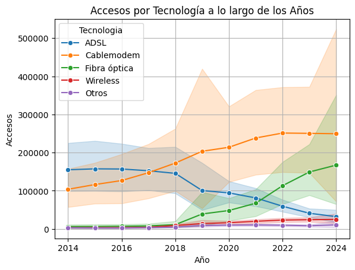

# Análisis de Datos: Telecomunicaciones en Argentina

Este repositorio contiene el trabajo realizado como parte del bootcamp en Ciencia de Datos, enfocado en el análisis de datos relacionados con las telecomunicaciones en Argentina. El objetivo del proyecto fue llevar a cabo un Análisis Exploratorio de Datos (EDA) utilizando Jupyter Notebook, empleando un dataset proveniente de múltiples hojas de un archivo Excel (`internet.xlsx`).

## Contenido

- **Dataset**: `internet.xlsx`
  - **Hojas Utilizadas**:
    - `Acc_vel_loc_sinrangos`
    - `Accesos Por Tecnología`
    - `Penetracion-hogares`
    - `Penetración-poblacion`

## Descripción del Proyecto

El análisis se centró en la exploración y limpieza de datos, con el objetivo de entender mejor el estado y evolución de las telecomunicaciones en Argentina. Los principales procedimientos realizados fueron:

1. **Búsqueda de Valores Faltantes**:
   - Identificación y tratamiento de valores nulos o ausentes.
   
2. **Detección de Outliers**:
   - Uso de diagramas de caja (boxplots) y otras técnicas para identificar valores atípicos en el dataset.

3. **Verificación de Formato e Integridad de Datos**:
   - Aseguramiento de la correcta codificación de los datos y verificación de su consistencia a lo largo de las diferentes hojas del dataset.
   
4. **Normalización de Datos**:
   - Aplicación de métodos de normalización para estandarizar los datos y permitir una comparación más efectiva entre las distintas variables.

## Resultados y Visualizaciones

A lo largo del análisis, se generaron diversos gráficos y visualizaciones que ayudaron a ilustrar los hallazgos más importantes:

- **Distribución de Accesos por Tecnología**:
  

Conclusiones: 
**Crecimiento de la Fibra Óptica:**

La tecnología de fibra óptica ha mostrado un crecimiento significativo a partir del año 2020, superando a otras tecnologías en accesos durante los años 2023 y 2024. Esto sugiere una preferencia creciente por esta tecnología, probablemente debido a sus ventajas en términos de velocidad y estabilidad.

**Declive del ADSL:**

La tecnología ADSL muestra una tendencia decreciente a lo largo de los años. Aunque fue popular en años anteriores, su uso ha disminuido, lo que podría estar relacionado con la adopción de tecnologías más avanzadas como la fibra óptica y el cablemodem.

**Estabilidad del Cablemodem:**

La tecnología de cablemodem ha mantenido un crecimiento constante, situándose como una opción intermedia en términos de popularidad y uso. Aunque no crece tan rápidamente como la fibra óptica, sigue siendo una opción sólida para muchos usuarios.

**Wireless y Otros:**

Las tecnologías wireless y otras (posiblemente satelital o DSL) han mantenido un uso relativamente bajo en comparación con ADSL, cablemodem, y fibra óptica. No obstante, parecen tener una base estable de usuarios, aunque no han experimentado un crecimiento significativo.

**Preferencias Tecnológicas:**

A lo largo de los años, las preferencias tecnológicas en Argentina han evolucionado. La transición de tecnologías más antiguas como ADSL a tecnologías más avanzadas como la fibra óptica es evidente en este gráfico, reflejando un cambio en la infraestructura y las demandas de los consumidores.
Este gráfico sugiere una transformación del mercado de telecomunicaciones, donde las tecnologías más nuevas y avanzadas están ganando terreno, mientras que las más antiguas están siendo reemplazadas o están en declive.

- **Penetración de Internet por Hogares**:
  

- **Evolución de la Penetración de Internet en la Población**:
  

Estos gráficos muestran cómo ha evolucionado el acceso a internet y su penetración en diferentes sectores de la población argentina, destacando las tecnologías más utilizadas y las tendencias a lo largo de los años.

## Procedimientos para un Buen Análisis de Datos

Realizar un análisis de datos efectivo implica seguir una serie de pasos cruciales:

1. **Comprensión del Contexto**:
   - Antes de comenzar con el análisis, es esencial entender el dominio y el contexto de los datos.
   
2. **Exploración Inicial**:
   - Revisar el dataset, comprender su estructura, y realizar un análisis preliminar para detectar patrones, tendencias, y posibles problemas.
   
3. **Limpieza de Datos**:
   - Identificación y corrección de errores, valores nulos, y outliers que puedan distorsionar los resultados del análisis.
   
4. **Análisis Exploratorio (EDA)**:
   - Utilizar visualizaciones y estadísticas descriptivas para identificar relaciones y patrones en los datos.
   
5. **Normalización y Transformación de Datos**:
   - Preparar los datos para su análisis mediante la normalización, estandarización o transformación de variables.

6. **Validación de Resultados**:
   - Asegurarse de que los resultados obtenidos sean coherentes y estén alineados con el contexto y objetivos del análisis.

## Conclusión

El análisis de los datos de telecomunicaciones en Argentina reveló importantes tendencias y patrones sobre el acceso y penetración de internet en el país. Este trabajo no solo permitió comprender mejor el estado actual del sector, sino también sentar las bases para futuros estudios y análisis más profundos.

