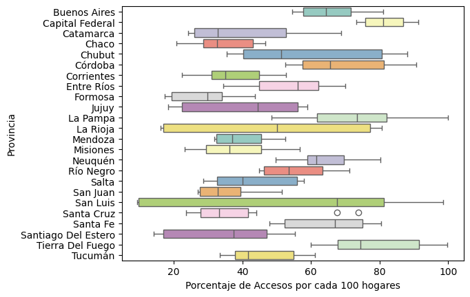
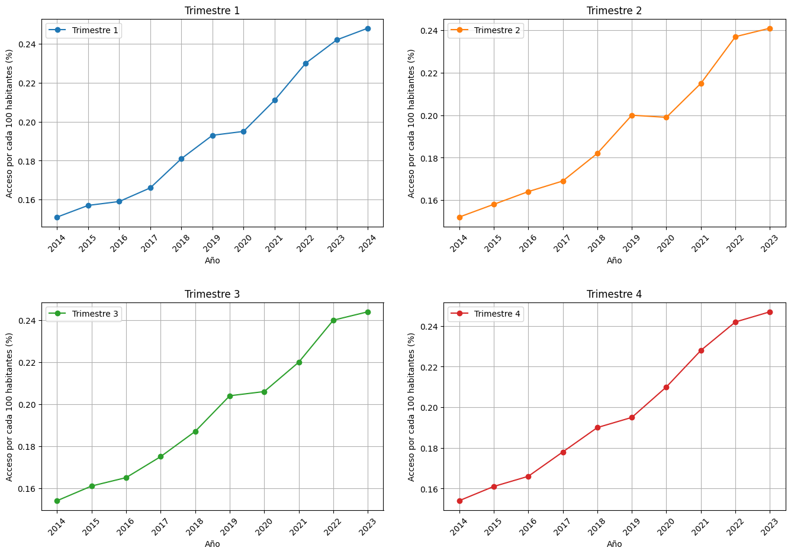

# Análisis de Datos: Telecomunicaciones en Argentina

Este repositorio contiene el trabajo realizado como parte del bootcamp en Ciencia de Datos, enfocado en el análisis de datos relacionados con las telecomunicaciones en Argentina. El objetivo del proyecto fue llevar a cabo un Análisis Exploratorio de Datos (EDA) utilizando Jupyter Notebook, empleando un dataset proveniente de múltiples hojas de un archivo Excel (`internet.xlsx`).

## Contenido

- **Dataset**: `internet.xlsx`
  - **Hojas Utilizadas**:
    - `Acc_vel_loc_sinrangos`
    - `Accesos Por Tecnología`
    - `Penetracion-hogares`
    - `Penetración-poblacion`

## Descripción del Proyecto

El análisis se centró en la exploración y limpieza de datos, con el objetivo de entender mejor el estado y evolución de las telecomunicaciones en Argentina. Los principales procedimientos realizados fueron:

1. **Búsqueda de Valores Faltantes**:
   - Identificación y tratamiento de valores nulos o ausentes.
   
2. **Detección de Outliers**:
   - Uso de diagramas de caja (boxplots) y otras técnicas para identificar valores atípicos en el dataset.

3. **Verificación de Formato e Integridad de Datos**:
   - Aseguramiento de la correcta codificación de los datos y verificación de su consistencia a lo largo de las diferentes hojas del dataset.
   
4. **Normalización de Datos**:
   - Aplicación de métodos de normalización para estandarizar los datos y permitir una comparación más efectiva entre las distintas variables.

## Resultados y Visualizaciones

A lo largo del análisis, se generaron diversos gráficos y visualizaciones que ayudaron a ilustrar los hallazgos más importantes:

## **1. Distribución de Accesos por Tecnología**:

  

## **Conclusiones:**  
**Crecimiento de la Fibra Óptica:**

La tecnología de fibra óptica ha mostrado un crecimiento significativo a partir del año 2020, superando a otras tecnologías en accesos durante los años 2023 y 2024. Esto sugiere una preferencia creciente por esta tecnología, probablemente debido a sus ventajas en términos de velocidad y estabilidad.

**Declive del ADSL:**

La tecnología ADSL muestra una tendencia decreciente a lo largo de los años. Aunque fue popular en años anteriores, su uso ha disminuido, lo que podría estar relacionado con la adopción de tecnologías más avanzadas como la fibra óptica y el cablemodem.

**Estabilidad del Cablemodem:**

La tecnología de cablemodem ha mantenido un crecimiento constante, situándose como una opción intermedia en términos de popularidad y uso. Aunque no crece tan rápidamente como la fibra óptica, sigue siendo una opción sólida para muchos usuarios.

**Wireless y Otros:**

Las tecnologías wireless y otras (posiblemente satelital o DSL) han mantenido un uso relativamente bajo en comparación con ADSL, cablemodem, y fibra óptica. No obstante, parecen tener una base estable de usuarios, aunque no han experimentado un crecimiento significativo.

**Preferencias Tecnológicas:**

A lo largo de los años, las preferencias tecnológicas en Argentina han evolucionado. La transición de tecnologías más antiguas como ADSL a tecnologías más avanzadas como la fibra óptica es evidente en este gráfico, reflejando un cambio en la infraestructura y las demandas de los consumidores.
Este gráfico sugiere una transformación del mercado de telecomunicaciones, donde las tecnologías más nuevas y avanzadas están ganando terreno, mientras que las más antiguas están siendo reemplazadas o están en declive.

## **2. Penetración de Internet por Hogares**:

  
## **Conclusiones:**
El gráfico que se presenta es un diagrama de cajas (box plot) que muestra la distribución de los accesos por cada 100 hogares en varias provincias argentinas.Las conclusiones son:

__Variabilidad de Accesos:__

Las provincias presentan una gran variabilidad en cuanto a los accesos por cada 100 hogares. Algunas provincias tienen una dispersión más amplia (e.g., Buenos Aires, Córdoba, Santa Fe), mientras que otras tienen una dispersión más estrecha (e.g., La Rioja, Mendoza).

__Medianas y Rangos Intercuartílicos:__

Provincias como Buenos Aires y Córdoba tienen medianas más altas, indicando un mayor número de accesos por cada 100 hogares. Provincias como Formosa y Santiago del Estero tienen medianas más bajas, indicando un menor número de accesos.

__Valores Atípicos:__

Se observan algunos valores atípicos, como en las provincias de Formosa y San Luis, que indican valores de acceso significativamente diferentes del resto de los datos.

__Comparaciones Entre Provincias:__

Buenos Aires y Córdoba parecen tener los mayores niveles de accesos por cada 100 hogares. Provincias como La Pampa y Tucumán tienen medianas similares, pero diferentes niveles de variabilidad.

__Rangos de Accesos:__

La mayoría de las provincias tienen rangos de accesos que varían considerablemente, lo que sugiere diferencias significativas en la conectividad dentro de las mismas provincias. En resumen, el gráfico muestra una diversidad considerable en los accesos por cada 100 hogares entre las diferentes provincias argentinas, con algunas provincias destacándose por tener una mayor conectividad y otras con menos accesos. La variabilidad dentro de las provincias también es notable, lo que indica disparidades internas en el acceso a servicios.

## **3. Evolución de la Penetración de Internet en la Población**:

  

## **Conclusiones del Análisis de los Gráficos de Accesos por Trimestre**
El conjunto de gráficos refleja la evolución del porcentaje de accesos por cada 100 habitantes, desglosado por trimestres, desde 2014 hasta 2023. Las conclusiones derivadas de estos gráficos son las siguientes:

**1. Tendencia General:** A lo largo de los años, todos los trimestres muestran una tendencia al alza en el porcentaje de accesos por cada 100 habitantes, lo que indica un crecimiento constante y sostenido en los accesos.

**2. Comparación entre Trimestres:** Los cuatro trimestres exhiben una tendencia de crecimiento similar desde 2014 hasta 2023. La consistencia en la pendiente de crecimiento sugiere que ningún trimestre se destaca significativamente en términos de aumento de accesos.

**3. Puntos de Crecimiento Significativo:** A partir de 2017, se observa un aumento más pronunciado en todos los trimestres. Entre 2020 y 2021, hay un incremento notable en el crecimiento, probablemente impulsado por la pandemia de COVID-19, que generó una mayor demanda de accesos debido al teletrabajo y la educación en línea.

**4. Año 2023:** En 2023, cada trimestre alcanza los valores más altos, llegando aproximadamente al 0.24% de accesos por cada 100 habitantes.

**5. Estacionalidad:** No se detecta una estacionalidad marcada en los datos, ya que el crecimiento es relativamente uniforme entre los trimestres. Esto sugiere que el aumento en los accesos ha sido constante a lo largo de los años sin grandes fluctuaciones estacionales.

En resumen, los gráficos evidencian un crecimiento constante y sostenido en el porcentaje de accesos por cada 100 habitantes en Capital Federal, con un incremento notable a partir de 2017 y picos máximos en 2023. La tendencia de crecimiento es homogénea entre los cuatro trimestres, sin indicios de estacionalidad significativa.

## Procedimientos para un Buen Análisis de Datos

Realizar un análisis de datos efectivo implica seguir una serie de pasos cruciales:

1. **Comprensión del Contexto**:
   - Antes de comenzar con el análisis, es esencial entender el dominio y el contexto de los datos.
   
2. **Exploración Inicial**:
   - Revisar el dataset, comprender su estructura, y realizar un análisis preliminar para detectar patrones, tendencias, y posibles problemas.
   
3. **Limpieza de Datos**:
   - Identificación y corrección de errores, valores nulos, y outliers que puedan distorsionar los resultados del análisis.
   
4. **Análisis Exploratorio (EDA)**:
   - Utilizar visualizaciones y estadísticas descriptivas para identificar relaciones y patrones en los datos.
   
5. **Normalización y Transformación de Datos**:
   - Preparar los datos para su análisis mediante la normalización, estandarización o transformación de variables.

6. **Validación de Resultados**:
   - Asegurarse de que los resultados obtenidos sean coherentes y estén alineados con el contexto y objetivos del análisis.

## Conclusión

El análisis de los datos de telecomunicaciones en Argentina reveló importantes tendencias y patrones sobre el acceso y penetración de internet en el país. Este trabajo no solo permitió comprender mejor el estado actual del sector, sino también sentar las bases para futuros estudios y análisis más profundos.

